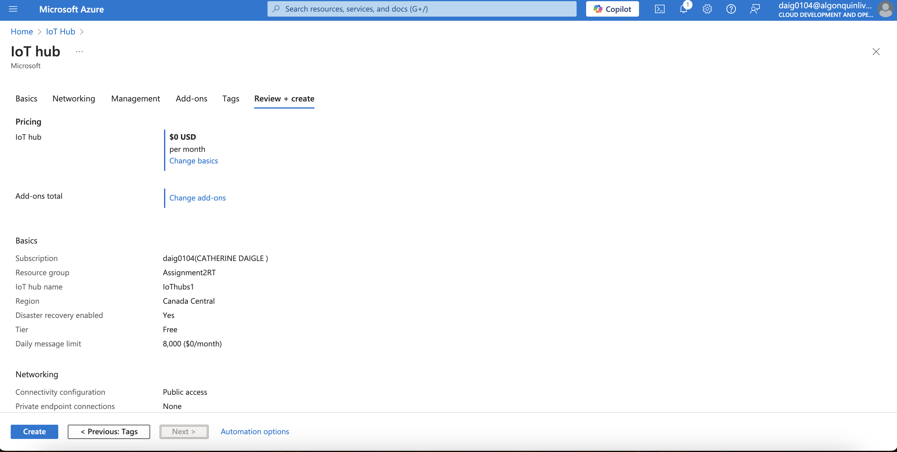

# Assignment 2

Catherine Daigle - 41175118


## Scenario Description:
The Rideau Canal Skateway is a canal in Ottawa that, throughout the winter season, allows the public to skate onto the ice within the canal, making it one of Ottawa's largest skating attractions. The issue is that given global warming and the skateway being a canal, the National Capital Commission (NCC) must determine whether the canal is safe enough for the general public to skate on or close the canal for the rest of the winter. This issue can be solved by placing IoT sensors within the canal to measure the following:

Ice Thickness (in cm) - ensures the public does not fall into thin ice. Surface Temperature (in Celsius) - To determine if the ice is melting Snow Accumulation (in cm) - Cannot skate in heavy snow and weakens the ice structure. External Temperature (in Celsius) - Determines in general if it is safe to skate in the canal outside.

The analysis and processing of this data and visualizing the data in an understandable way will notify the NCC to determine the appropriate measures taken to open the canal without risking public safety. With IoT sensors, information about the canal's condition can be determined in real-time, allowing the NCC to make specific conditions when opening the canal. For example, the NCC may open the canal on a day they deem safe and close the canal the next day, or they may close certain sections of the canal they deem too unsafe for the public. With real-time monitoring, the NCC can issue warnings or determine appropriate actions with sudden weather changes.


## System Architecture Diagram:


The architecture diagram above is a fairly simple archetecture that shows the relationship of the IoT devices and the Azure Cloud services.  The IoT devices send their data via a connection string to IoT hub which is then sent to Azure Stream Analytics for processing.  When the data is finished processing it is then sent to Azure Blob storage where it is stored in containers.


## Implementation Details:


### IoT Sensor Simulation:


The main flow of the above app is in the `main` method. There is a `while` loop set to true, so that it continues to run indefinitely. Inside that loop is an array of locations. For each location in one iteration of the `while` loop, numbers are generated for our json variables. The json and an index number is sent to the `sendToIotHub()` method, which handles sending of the data to the endpoints specified in the below:


"The most important parameter of *[the Device on Iot Hub]* here, is the primary connection string." (Basu, 2023). A device can be 'named' and connection strings/keys generated through the IoT Hub in the Azure Portal. The generated primary connection string should be then added to an environment variable, or in the `.env` file as shown in the previous screenshot.

This .env file is part of a virtual environment where we define our environment variables. See the below screenshot for where we define our array with the fetched environment variables (connection strings), and how we use the passed `data` and index (`conn`) to send the message.


Each iteration of the inner loop pauses for 10 seconds after sending a message to IoT Hub. Further development of this program might consider externalizing the sleep/wait time to an environment variable for further configuration.

For The sensors the JSON payload is is seperated into ice thickness, surface temperature, snow accumulation, and external temperature.  we use data = json to send to IoT hub a JSON payload.  This data is sent however many times there are new locations as we treat each new location as a new device setup.


### Azure IoT Hub Configuration:
The Configurtion Steps for Iot are demonstrated in screenshots below "Usage instructions" within "Creating IoT hub". For the configurations we chose to pick the most cost-effective options such as the free tier option.  For Networking, we picked a public network as using a private network although secure, can complicate the process.  
IoT Hub Overview.


Creating an IoT hub Device This process is repeated two more times to create a total of three devices, one for each region


IoT connection Strings. These endpoints are used within the .env file of the IoT simulation code to connect simulated devices to Azure IoT hub. The important connection used is the Primary Connection String. Using the python code as before, after the connection is made, the messages are then routed to the IoT hub.


### Azure Stream Analytics Job:

Review of Stream Analytics job Settings


Here, the input is created. We picked Messeging as the endpoint and JSON our input format since the simulation IoT devices output JSON. The source of the input is the IoT hub, therefore stream analytics retrieves and processes the data in IoT Hub.


The Output is created, Here it is linked to the storage container JSONstorage1, we picked this name originally since it stores JSON file format, but a more accurate name should have been IceWarningLogs, as later that container was used to store logs that the ice was not safe to skate on. The organization format is in array form as it is much easier to parse the information.  


Querying Azure Stream Analytics

A basic query can be:

```SQL
SELECT * INTO [jsonstorage1] FROM [IoThubs1]
```

This shows us rows full of our sensor data, unfiltered.


Changing Analyzation screen query, this query specifies that only Unsafe ice conditions are logged and stored into the container.  unsafe conditions are as follows:  Ice thickness is < 5, Surface Temperature > 0, Snow Accumulation > 3, or External Temperature > 0.  We chose > 0 degrees celsius as an unsafe condition for both temperature and surface temperature since ice melts above the freezing point.


### Azure Blob Storage:
Creating A Storage Account Picking standard azure blob storage account and locally redundant storage:

Kept the advanced settings as default:

Enabled public access to networking, for ease of use and not to encounter networking issues.

Disabled soft delete, as this is a test resource and makes deleting resources afterwards easier

Default Encryption settings

Created Blob Storage container, default settings.


The storage is processed into a container storage as a JSON format in an array folder structure.  At the time, we chose the naming convention of the container that contains the processed data as jsonstorage1.  We chose this naming convention due to the fact that the container would be used to store JSON files only.  However, if a more appropriate name for the container would be "iceWarningLogs" since we have opted to have the container store log file data of times where the Canal Skateway is too dangerous for the public to skate on. 

## Usage Instructions:

### Running the IoT Sensor Simulation:
Follow the following steps to set up and run the simulation for the three IoT devices:

1. In the project root folder, create a `.env` file with the following fields:
    - `IOTHUB_CONN_STR1`
    - `IOTHUB_CONN_STR2`
    - `IOTHUB_CONN_STR3`
    - Each field should have the IoT Hub connection string from one of three Created Devices in IoT Hub, example: <br> `IOTHUB_CONN_STR1 = "HostName=IoThubs1.azure-devices.net;DeviceId=iotsensor1;SharedAccessKey=<string>"`
2. Open a terminal and navigate to the project directory. Run: `python -m venv .venv`
3. `.venv\scripts\activate` to activate the virtual environment (if not already activated), which will have your 3 environment variables from step 1.
4. `pip install -r requirements.txt` to install the requirements (2).
5. `py sensor-simulation/sensor.py` to run the program.

### Configuring Azure Services:

#### Creating Azure IoT Hub:
The basic tab of IoT hub creation, picking free tier.

Picking public access networking

Shared Access policy + RBAC

No defender or updates

Review of IoT hub

]
Creating an IoT hub Device This process is repeated two more times to create a total of three devices, one for each region

Result of three IoT devices


#### Creating Azure Stream Analytics Job:

Creating a New stream Analytics Job, We picked 1/3 in streaming units for cost effectiveness


Connecting Stream Analytics Job to the appropriate storage blobstoragecan the creation of the storaage is shown in the Azure Blob Storage Section


Here, the input is created we picked Messeging as the endpoint and JSON our input format since the simulation IoT devices output JSON

Here, the Output is created, Here it is linked to the storage container JSONstorage1, we picked this name originally since it stores JSON file format, but a more accurate name should have been IceWarningLogs, as later that container was used to store logs that the ice was not safe to skate on. The organization format is in array form as it is much easier to parse the information.

Result of the Stream output/input creation:


### Accessing Stored Data:
Before retrieving the results I had to create a diagnostic settings to Run the Stream analytics job:


After 10 seconds, the stream jobs output a JSON file to the jsonstorage container


## Results:

Stream Analytics Recieving Simulated messages:


Confirming that the data has been proccessed into an array format as JSON:


After the testing of the IoT devices and the assignment, we deleted our resources 


## Reflection:

In this assignment we learned a lot about the development process and the specifics about navigating Azure's environment to set up a pipeline from IoT Device (Thing) to Cloud.

There were challenges from the beginning. Our initial approach posed challenges in availability of libraries (Java) and restrictions because of our choice in build automation tools. We were forced to rethink our approach, and ended up going with a language that in retrospect is a lot more suited to development of cloud-interacting applications like the sensor simulation. The resulting simulation code (Python) is so much more lightweight and faster to set up than our original approach with Java. With Java, there was difficulty in navigating the Azure IoT Java SDK as the samples did not come with detailed enough explanations as to how to use its various mechanisms, such as making a connection. Furthermore, our choice in building tool gave us issues that compounded our frustration. Switching to Python, our application code shrunk to 1/4th the size, and importing dependencies was made simple with a `requirements.txt` and `pip` command. Furthermore, there is much more documentation with Python, highlighting the lesson that research into appropriate developing languages is a worthwhile step to cloud development.

More challenges were brought forth when navigating the Azure Portal. The Azure portal is highly structured, but with the abundance of menus and the particular requirements of certain services like Analytics Stream requiring a storage container and diagnostic settings set first, it was clear that we needed guidance as to the order of creation along with the settings.

There are some noteworthy resources available for those who need a step-by-step walkthrough of doing exactly what we did in this assignment. Please see the References section if curious.

When we finally started the batch job to process the "data that indicates sub-par skating conditions" and everything moved along smoothly, we reflected on the process and what we would do differently if we were to do this again.

1. **More research into programming languages** and available documentation within the communities/projects.
2. **Naming conventions are important.** We kept our naming conventions to "function + id number" such as `jsonstorage1`, because its function was to host json data. But this isn't an appropriate naming convention for bigger projects, as it says nothing of its purpose to store specifically *processed* data and warnings about sub-par skating conditions.
3. **Create the step-by-step setup plan**, including order of creation for services. This may require gathering documentation or video tutorials, but it saves on time when the target service is something never used before.

In the end, it was a valuable experience with practical lessons to be learned.


## References:

- Basu, A. (2023, August 31). Sending simulated data to IoT hub using Python. YouTube. https://www.youtube.com/watch?v=JEffAb_3DlE 
- Vidiv Academy. (2023, December 26). Azure IoT Hub Project with Stream Analytics | Streaming Data Azure Data Engineering Project. https://www.youtube.com/watch?v=oxD6nEAUXuA
